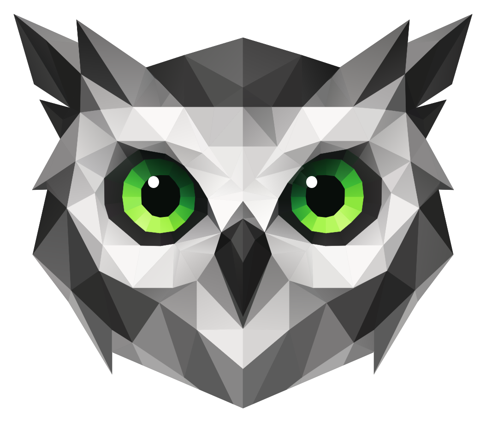

  

# Browlet

A headless web browser for Node.js, built against web standards.

## Development status

Browlet is in early development. Many of the underlying subsystems are in place;
the next focus is DOM, HTML, and document loading.

CSS and layout remain substantial work ahead. Scope beyond layout is still open.

## WPT Coverage

  

Humble beginnings: the runner currently supports a small selection of WPT tests.
Broader coverage depends on document and script loading, DOM support, and WPT
server integration.

## Resources

[Build from source](BUILDING.md) · [Fetch](src/fetch/README.md) · [Node compatibility](node-compat/README.md)

Standalone engines: [Selectlet](packages/selectlet/README.md) (selectors) · [Stylelet](packages/stylelet/README.md) (styles)
